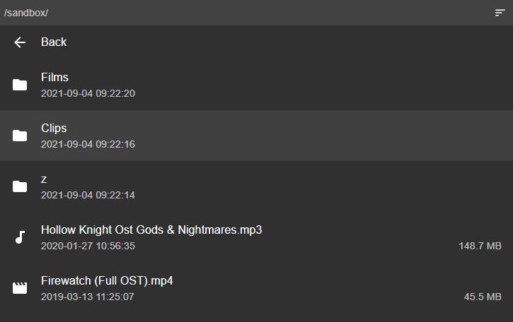

<div align="center">
	
	<h1>GoHFS</h1>
	<p>
		<b>Simple file server</b>
	</p>
	<br>
	<br>
	<br>
</div>

Build exe
---
````
go build -ldflags -H=windowsgui -trimpath -o goHFS.exe
````

Build mac app
---
```
go get github.com/strosel/appify
go install github.com/strosel/appify
rm ./goHfs
rm -r ./goHFS.app
go build -trimpath -o goHFS
~/go/bin/appify -menubar -name goHFS -author "Anton V" -id com.rndnm.gohfs -icon ./assets/icon.icns goHFS
rm ./goHFS.app/Contents/README
```

Build resources with go-bindata
---
````
go get github.com/jteeuwen/go-bindata/...
go install github.com/jteeuwen/go-bindata/...
~/go/bin/go-bindata ./icon.ico ./folder.html
````

File icon, use rsrc 
---
````
.\rsrc_windows_amd64.exe -ico .\icon.ico -o FILE.syso
````
