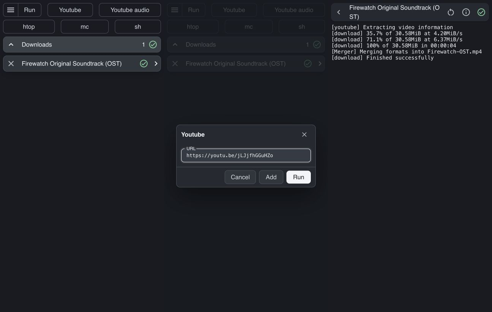
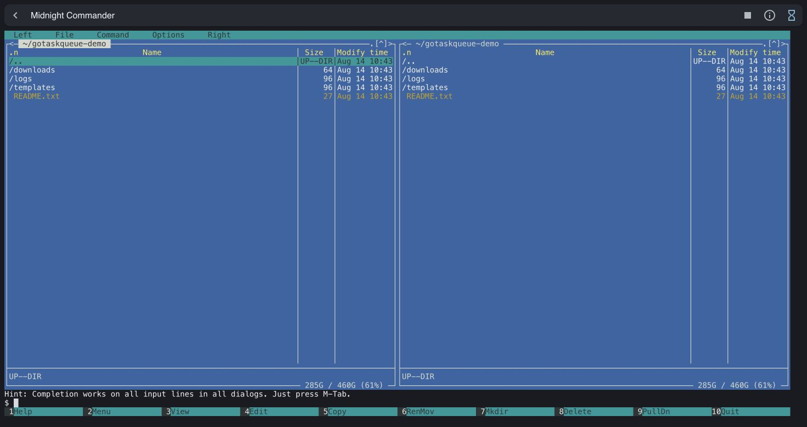

<div align="center">
	
	<h1>GoTaskQueue</h1>
	<p>
		<b>Simple task runner</b>
	</p>
	<br>
	
	<br>
	<br>
</div>

Build exe
---
````
go build -ldflags -H=windowsgui -trimpath -o goTaskQueue.exe
````

Build mac app
---
```
./scripts/build.mac.sh
```

Build the production UI and application
---
````
./scripts/build.sh
````

The build script compiles the UI and embeds it in the Go binary automatically.

File icon, use rsrc 
---
````
.\rsrc_windows_amd64.exe -ico .\icon.ico -o FILE.syso
````
